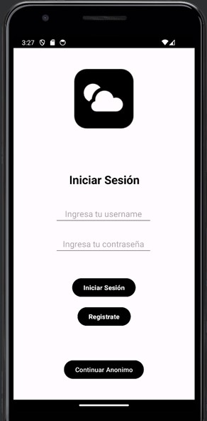
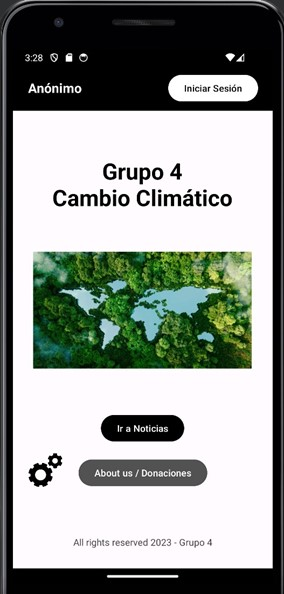
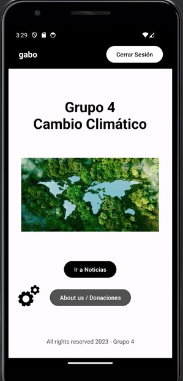
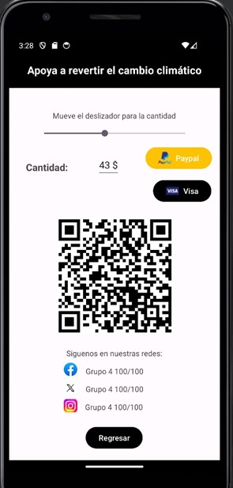
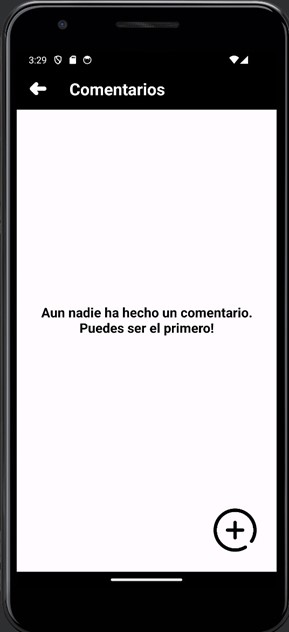
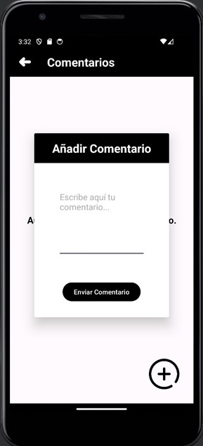

# Climate Change App en Android Studio

Esta aplicación móvil "Climate Change App" fue desarrollada en Android Studio e implementa funcionalidades de inicio de sesión con una base de datos, diversos componentes, actividades y fragmentos.

## Descripción

La "Climate Change App" es una aplicación móvil que proporciona información sobre el clima y noticias relacionadas con el clima. Además de las características de pronóstico del tiempo, la aplicación también permite a los usuarios iniciar sesión para acceder a funcionalidades adicionales.

## Características Principales

- **Inicio de Sesión:** Los usuarios pueden iniciar sesión en la aplicación utilizando sus credenciales.
- **Base de Datos:** Se implementa una base de datos para almacenar la información de los usuarios y otros datos relevantes.
- **Noticias sobre el Clima:** Proporciona noticias relacionadas con el clima.
- **Diversos Componentes:** La aplicación utiliza una variedad de componentes de Android, incluyendo actividades y fragmentos, para proporcionar una experiencia de usuario rica.
- **Comentarios:** La aplicación permite a los usuarios registrados agregar comentarios en la aplicación.

## Tecnologías Utilizadas

- Android Studio
- Java
- XML
- SQLite

## Capturas de Pantalla

<h3>
  Log In
</h3>

  
   
  

En esta captura se aprecia el inicio de sesión del aplicativo. Los usuarios pueden ingresar sus credenciales para acceder a funcionalidades adicionales de la aplicación. La pantalla de inicio de sesión proporciona campos para ingresar el nombre de usuario y la contraseña, junto con botones para iniciar sesión o registrarse si es necesario. Este proceso de inicio de sesión es la puerta de entrada a la experiencia completa de la aplicación "Climate Change App".
 

<h3>
  Inicio (Anónimo)
</h3>

  
   

Esta captura muestra la página de inicio de la aplicación cuando ningún usuario ha iniciado sesión. La pantalla de inicio proporciona una vista general de la aplicación y su funcionalidad principal, como el pronóstico del tiempo y las últimas noticias relacionadas con el clima. Los usuarios no registrados pueden explorar esta información básica y, si lo desean, pueden iniciar sesión para acceder a funcionalidades adicionales y personalizadas. La página de inicio es la primera impresión que los usuarios tienen de la aplicación y está diseñada para ser intuitiva y atractiva, brindando una experiencia agradable desde el primer momento.
 

<h3>
  Inicio (Autenticado)
</h3>

  
   
  

Esta captura muestra la página de inicio de la aplicación cuando un usuario está autenticado. La pantalla de inicio presenta información personalizada para el usuario, como el pronóstico del tiempo para su ubicación actual, noticias relevantes basadas en sus preferencias y cualquier otra información específica del usuario. Además, puede mostrar elementos de navegación adicionales o funcionalidades exclusivas disponibles solo para usuarios autenticados, como la posibilidad de guardar ubicaciones favoritas o configurar notificaciones personalizadas. La página de inicio proporciona una experiencia personalizada y relevante para cada usuario, mejorando así su satisfacción y compromiso con la aplicación.
 

<h3>
  Donaciones
</h3>

  
   
  

Esta sección de la aplicación presenta la funcionalidad de donación, diseñada para permitir a los usuarios contribuir con fondos para apoyar el proyecto. Sin embargo, es importante destacar que la implementación actual utiliza un `SeekBar` como método para introducir la cantidad de dinero a donar. Aunque esta funcionalidad cumple con los requerimientos de la universidad, es crucial reconocer que esta no es la mejor práctica para la introducción de cantidades monetarias debido a la falta de precisión y usabilidad.

**Nota Importante:** Se recomienda encarecidamente revisar y mejorar esta funcionalidad en futuras iteraciones de desarrollo para garantizar una experiencia de usuario más segura y amigable. Posibles mejoras podrían incluir el uso de campos de texto o botones de incremento/decremento para introducir cantidades específicas y garantizar una mayor precisión en las donaciones.

Como desarrolladores responsables, nos comprometemos a mantener la seguridad y la calidad en todas las áreas de nuestra aplicación, y nos esforzamos por implementar las mejores prácticas en todo momento.
 

<h3>
  Comentarios (Vacío)
</h3>

  
   
  

Esta página muestra todos los comentarios emitidos por los usuarios en la aplicación. Proporciona una vista organizada y fácil de leer de los comentarios, lo que permite a los usuarios ver y responder a las opiniones de otros usuarios.

**Características Principales:**

- **Lista de Comentarios:** La página muestra una lista de todos los comentarios emitidos por los usuarios, con información relevante como el contenido del comentario, el nombre del usuario y la fecha de publicación.
- **Interfaz de Usuario Intuitiva:** El diseño de la página se centra en proporcionar una experiencia de usuario intuitiva y agradable, lo que facilita la lectura y la interacción con los comentarios.

En esta captura específica, se muestra la página de comentarios cuando no hay comentarios disponibles actualmente. Esto puede suceder en situaciones donde no se han agregado comentarios recientes o cuando no hay comentarios para mostrar en una sección específica de la aplicación. Los usuarios pueden regresar más tarde o participar activamente para comenzar la conversación y llenar la página con comentarios relevantes.
 

<h3>
  Agregar Comentarios
</h3>

  
   
  

Esta página presenta un fragmento personalizado diseñado específicamente para permitir a los usuarios agregar comentarios. El fragmento proporciona un formulario intuitivo que permite a los usuarios ingresar su comentario y enviarlo para su publicación. Además, puede incluir funcionalidades adicionales, como la capacidad de adjuntar imágenes o seleccionar etiquetas relacionadas con el comentario.

**Características Principales:**

- **Formulario de Comentarios:** El fragmento presenta un formulario claro y conciso que permite a los usuarios escribir y enviar sus comentarios de manera sencilla.
- **Validación de Entrada:** Se implementa una validación de entrada para garantizar que los comentarios introducidos cumplan con ciertos criterios, como la longitud mínima o la ausencia de contenido inapropiado.
- **Interfaz de Usuario Personalizada:** El diseño del fragmento se adapta al diseño general de la aplicación para garantizar una experiencia de usuario cohesiva y atractiva.

Esta página es una parte integral de la experiencia del usuario en la aplicación, ya que permite a los usuarios interactuar y compartir sus opiniones y comentarios sobre el contenido proporcionado.
 

<h3>
  Comentarios (Agregado)
</h3>

  
   
  

Esta página muestra todos los comentarios emitidos por los usuarios en la aplicación. Proporciona una vista organizada y fácil de leer de los comentarios, lo que permite a los usuarios ver y responder a las opiniones de otros usuarios.

**Características Principales:**

- **Lista de Comentarios:** La página muestra una lista de todos los comentarios emitidos por los usuarios, con información relevante como el contenido del comentario, el nombre del usuario y la fecha de publicación.
- **Interfaz de Usuario Intuitiva:** El diseño de la página se centra en proporcionar una experiencia de usuario intuitiva y agradable, lo que facilita la lectura y la interacción con los comentarios.
- **Funcionalidades de Interacción:** Los usuarios pueden realizar acciones adicionales, como responder a comentarios, marcar comentarios como favoritos o informar sobre contenido inapropiado.

En esta captura específica, se muestra un ejemplo de un comentario previamente agregado por un usuario. Los usuarios pueden desplazarse por la lista para ver todos los comentarios y participar en la conversación según sea necesario.
 

## Autor

- Alberto Somoza
- Emilio Somoza
- Carlos Sánchez
- Gabriel Sanson
